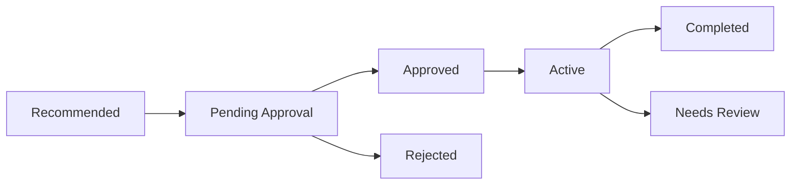
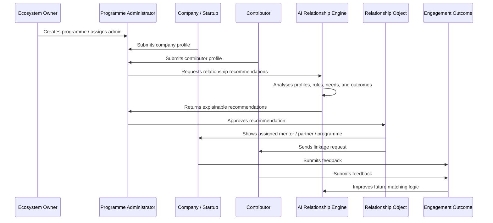

````markdown
# Lattice — Detailed MVP Specification  
## AI-Enabled Platform for Automating Ecosystem Linkages Instead of Manual Coordination

## 1. MVP Summary

**Lattice** is an AI-enabled platform that helps innovation ecosystem owners and programme administrators automatically create, manage, govern, reuse, and improve relationships between companies, mentors, partners, service providers, and programmes.

The platform directly addresses the hackathon problem: current innovation ecosystem platforms rely heavily on manual coordination to verify participants, match mentors, assign companies to programmes, and manage partner linkages. These relationships are usually handled as ad hoc, one-off assignments instead of structured, reusable, programmable entities. :contentReference[oaicite:0]{index=0}

Lattice turns these ecosystem relationships into **first-class system entities**.

Instead of saying:

> “This startup was manually assigned to this mentor.”

Lattice says:

> “This company-to-mentor relationship was generated, scored, explained, approved, tracked, evaluated, and stored for reuse across future programmes and initiatives.”

---

# 2. Core Interpretation of the Problem Statement

## The problem is not simply:

- Event management
- Mentor directory management
- Startup listing
- CRM
- Chatbot support
- Programme application form

## The actual problem is:

Innovation ecosystem platforms do not have a consistent mechanism to manage relationships between ecosystem actors.

The PDF specifically highlights relationships such as:

- **Mentor-to-company**
- **Company-to-programme**
- **Partner-to-initiative**
- **Company-to-service provider**
- **Programme administrator-to-participant**
- **Ecosystem owner-to-programme**

The issue is that these linkages are usually manually coordinated, inconsistent, hard to reuse, and difficult to scale across countries, programmes, and initiatives. :contentReference[oaicite:1]{index=1}

---

# 3. MVP Goal

## Primary Goal

Build a working prototype where a programme administrator can onboard ecosystem actors, use AI to generate explainable relationship recommendations, approve those recommendations, track active linkages, and collect engagement outcomes to improve future matching.

## MVP One-Liner

> Lattice is an AI-powered relationship orchestration platform for innovation ecosystems that automates how companies, mentors, partners, service providers, and programmes are connected, governed, reused, and improved over time.

---

# 4. Main System Hierarchy

```mermaid
flowchart TD
    A[Ecosystem Owner] --> B[Programmes / Initiatives]
    B --> C[Programme Administrators]
    C --> D[Companies / Startups]
    C --> E[Mentors]
    C --> F[Partners]
    C --> G[Service Providers]
    D --> H[AI Relationship Engine]
    E --> H
    F --> H
    G --> H
    B --> H
    H --> I[AI Recommendations]
    I --> J[Approved Ecosystem Relationships]
    J --> K[Engagement Outcomes]
    K --> H
````

## Simple Explanation

The **Ecosystem Owner** creates or manages the wider innovation ecosystem.

Inside that ecosystem, there are multiple **programmes and initiatives**.

Each programme has **programme administrators**.

Companies join programmes or apply for support.

Mentors, partners, and service providers offer expertise, resources, or services.

The **AI Relationship Engine** recommends the best linkages.

Admins approve or reject those linkages.

The system tracks outcomes.

Those outcomes improve future recommendations.

---

# 5. Core Roles

## Role 1: Ecosystem Owner

The ecosystem owner is the highest-level actor.

Examples:

* Cradle Fund
* Startup agency
* Government innovation body
* University entrepreneurship centre
* Accelerator network
* Corporate innovation ecosystem

### Responsibilities

| Responsibility           | Description                                                       |
| ------------------------ | ----------------------------------------------------------------- |
| Manage ecosystem         | Oversees the whole platform environment                           |
| Create programmes        | Adds initiatives, accelerators, grant programmes, bootcamps, etc. |
| Manage admins            | Assigns programme administrators                                  |
| View ecosystem analytics | Sees relationship performance across programmes                   |
| Define governance rules  | Sets high-level matching and approval rules                       |
| Monitor scalability      | Tracks ecosystem growth across programmes and countries           |

### MVP Features

* Ecosystem dashboard
* Programme list
* Cross-programme relationship analytics
* High-level AI insights
* Admin management

---

## Role 2: Programme Administrator

This is the most important role for the MVP.

The programme administrator is the person who currently does most of the manual coordination that the problem statement complains about.

### Responsibilities

| Responsibility            | Description                                       |
| ------------------------- | ------------------------------------------------- |
| Verify participants       | Checks whether companies are valid or eligible    |
| Manage programme          | Controls programme details and eligibility        |
| Review AI recommendations | Approves, rejects, or modifies suggested linkages |
| Assign mentors            | Confirms mentor-to-company relationships          |
| Manage partner linkages   | Connects partners to initiatives or companies     |
| Track outcomes            | Reviews engagement performance                    |

### MVP Features

* Review companies
* Verify participant profiles
* Run AI matching
* Approve relationship recommendations
* View relationship board
* Track engagement outcomes
* Generate ecosystem reports

---

## Role 3: Company / Startup

The company is the main participant that needs ecosystem support.

### Responsibilities

| Responsibility               | Description                                                |
| ---------------------------- | ---------------------------------------------------------- |
| Submit profile               | Provides company details, sector, stage, and support needs |
| Join programme               | Applies to or participates in programmes                   |
| Receive recommendations      | Gets matched to mentors, partners, and service providers   |
| Engage with ecosystem actors | Works with assigned mentors or partners                    |
| Submit feedback              | Reports whether the linkage was useful                     |

### MVP Features

* Company profile form
* Needs assessment
* Programme application
* Assigned relationship view
* Feedback submission

---

## Role 4: Contributor

For the MVP, combine mentors, partners, and service providers into one role called **Contributor**.

This avoids unnecessary role explosion.

A contributor can be:

* Mentor
* Partner
* Service provider
* Investor
* Cloud provider
* Legal advisor
* Technical advisor
* University lab
* Corporate partner

### Responsibilities

| Responsibility        | Description                                                       |
| --------------------- | ----------------------------------------------------------------- |
| Submit profile        | Provides expertise, capacity, and available support               |
| Accept linkages       | Confirms participation in relationships                           |
| Support companies     | Mentors, advises, funds, provides resources, or delivers services |
| Submit feedback       | Evaluates relationship quality                                    |
| Maintain availability | Updates capacity and support areas                                |

### MVP Features

* Contributor profile
* Expertise and service tagging
* Availability/capacity settings
* Relationship requests
* Feedback submission

---

## Role 5: AI Relationship Engine

This is not a human user, but it should be presented as a core system actor.

### Responsibilities

| Responsibility          | Description                                                                          |
| ----------------------- | ------------------------------------------------------------------------------------ |
| Understand profiles     | Converts unstructured profiles into structured tags                                  |
| Recommend relationships | Suggests company-to-mentor, company-to-programme, and partner-to-initiative linkages |
| Explain recommendations | Gives human-readable reasons for each match                                          |
| Detect risks            | Flags weak matches, conflicts, or low-capacity contributors                          |
| Learn from outcomes     | Uses previous engagement outcomes to improve future matches                          |

### MVP Features

* AI profile summarisation
* AI tagging
* Match scoring
* Explainable recommendations
* Relationship risk flags
* Future-match improvement suggestions

---

# 6. Main Entities in the System

## 6.1 Ecosystem

The top-level environment where all programmes, companies, contributors, and relationships exist.

### Example

```json
{
  "ecosystemName": "Malaysia Startup Growth Ecosystem",
  "owner": "Cradle Fund",
  "countries": ["Malaysia"],
  "focusAreas": ["AI", "Fintech", "Healthtech", "Sustainability"]
}
```

---

## 6.2 Programme

A **programme** is a structured initiative that supports companies.

It is not just an event.

### Examples

* AI Startup Accelerator
* Grant Readiness Programme
* Market Access Programme
* Founder Mentorship Cohort
* Corporate Innovation Challenge
* SME Digitalisation Initiative
* HealthTech Commercialisation Programme

### Programme Fields

| Field                  | Description                                                        |
| ---------------------- | ------------------------------------------------------------------ |
| Programme name         | Name of the initiative                                             |
| Programme type         | Accelerator, grant, mentorship, bootcamp, challenge, etc.          |
| Target sectors         | AI, fintech, healthtech, sustainability, etc.                      |
| Target company stage   | Idea, MVP, pre-seed, seed, growth                                  |
| Country/region         | Where the programme applies                                        |
| Eligibility rules      | Who can join                                                       |
| Available contributors | Mentors, partners, service providers attached to the programme     |
| Expected outcomes      | Funding readiness, pilot access, product validation, market access |
| Duration               | Programme timeline                                                 |

---

## 6.3 Company

The company is the startup, SME, or participant being supported by the ecosystem.

### Company Fields

| Field               | Description                                            |
| ------------------- | ------------------------------------------------------ |
| Company name        | Name of startup/company                                |
| Industry            | Sector or domain                                       |
| Stage               | Idea, MVP, pre-seed, seed, growth                      |
| Country             | Operating location                                     |
| Problem statement   | What the company is solving                            |
| Product description | What the company builds                                |
| Support needs       | Funding, mentorship, cloud, legal, market access, etc. |
| Current challenges  | Main blockers                                          |
| Programme interest  | Relevant programmes                                    |
| Past engagements    | Previous mentors, partners, or programmes              |
| Documents           | Pitch deck, registration proof, profile documents      |

---

## 6.4 Contributor

A contributor is any ecosystem actor that can support a company, programme, or initiative.

### Contributor Types

| Type               | Example                                                          |
| ------------------ | ---------------------------------------------------------------- |
| Mentor             | Founder, operator, domain expert                                 |
| Partner            | Google Cloud, university, corporate, NGO, government agency      |
| Service provider   | Legal firm, accounting firm, UX agency, cybersecurity consultant |
| Investor           | VC, angel investor, funding advisor                              |
| Technical provider | Cloud provider, AI advisor, software team                        |

### Contributor Fields

| Field             | Description                                           |
| ----------------- | ----------------------------------------------------- |
| Name              | Person or organisation name                           |
| Contributor type  | Mentor, partner, service provider, investor           |
| Expertise         | Sector or skill expertise                             |
| Supported stages  | Idea, MVP, seed, growth                               |
| Capacity          | Number of companies they can support                  |
| Availability      | Available / limited / unavailable                     |
| Country coverage  | Countries or regions supported                        |
| Previous outcomes | History of successful engagements                     |
| Conflict areas    | Competitors, restricted industries, unavailable areas |

---

## 6.5 Relationship

This is the most important entity in Lattice.

A relationship is a structured linkage between ecosystem actors.

### Relationship Types

| Relationship Type           | Example                                              |
| --------------------------- | ---------------------------------------------------- |
| Company-to-mentor           | Startup A matched with Mentor B                      |
| Company-to-programme        | Startup A assigned to AI Accelerator                 |
| Company-to-partner          | Startup A connected to Google Cloud                  |
| Company-to-service provider | Startup A connected to legal consultant              |
| Partner-to-initiative       | Google Cloud attached to AI Startup Programme        |
| Mentor-to-programme         | Mentor B assigned to HealthTech Accelerator          |
| Company-to-company          | Startup A connected with Startup B for collaboration |

### Relationship Fields

| Field             | Description                                                 |
| ----------------- | ----------------------------------------------------------- |
| Relationship ID   | Unique linkage ID                                           |
| Relationship type | Company-to-mentor, company-to-programme, etc.               |
| Source actor      | First entity                                                |
| Target actor      | Second entity                                               |
| Programme context | Programme where this linkage exists                         |
| AI match score    | Confidence score                                            |
| AI explanation    | Why this relationship was recommended                       |
| Status            | Recommended, pending, approved, active, completed, rejected |
| Admin owner       | Person responsible                                          |
| Expected outcome  | What the relationship should achieve                        |
| Engagement notes  | Progress updates                                            |
| Outcome score     | Final result                                                |
| Reusability tag   | Whether the pattern can be reused                           |

---

## 6.6 Engagement Outcome

An engagement outcome records whether a relationship worked.

This is critical because the PDF says current ecosystem platforms struggle to learn from previous engagements and reuse insights across future programmes. 

### Outcome Fields

| Field                       | Description                                                               |
| --------------------------- | ------------------------------------------------------------------------- |
| Relationship ID             | Link to relationship                                                      |
| Company feedback            | Company-side rating and comments                                          |
| Contributor feedback        | Mentor/partner/service-provider rating                                    |
| Admin evaluation            | Programme admin’s assessment                                              |
| Outcome achieved            | Yes / partial / no                                                        |
| Outcome type                | Funding, pilot access, mentorship value, technical support, market access |
| Relationship quality        | Low / medium / high                                                       |
| Future recommendation value | Should similar matches be repeated?                                       |
| Lessons learned             | AI-generated summary                                                      |

---

# 7. MVP Modules

## Module 1: Ecosystem Dashboard

### Purpose

Give programme administrators and ecosystem owners a clear overview of ecosystem activity.

### Dashboard Widgets

| Widget                     | Purpose                                                      |
| -------------------------- | ------------------------------------------------------------ |
| Total companies            | Number of onboarded companies                                |
| Active programmes          | Current programmes and initiatives                           |
| Pending AI recommendations | Suggested linkages awaiting approval                         |
| Active relationships       | Ongoing company-mentor/partner linkages                      |
| Contributor capacity       | Mentor/partner/service-provider availability                 |
| Relationship success rate  | Percentage of completed relationships with positive outcomes |
| AI alerts                  | Risks, bottlenecks, or weak matches                          |

### Example AI Alert

> “5 companies in the AI Accelerator need fundraising support, but only 1 available mentor has fundraising expertise. Consider onboarding more investor mentors.”

---

## Module 2: Programme Management

### Purpose

Allow admins to create and manage structured programmes.

### Features

* Create programme
* Define target sectors
* Define target company stages
* Add eligibility rules
* Attach contributors
* View companies assigned to programme
* View programme-level relationship health
* Track expected vs actual outcomes

### Example Programme

```json
{
  "programmeName": "AI Startup Accelerator 2026",
  "programmeType": "Accelerator",
  "targetSectors": ["AI", "SaaS", "Data Platforms"],
  "targetStages": ["MVP", "Pre-seed", "Seed"],
  "region": "Malaysia",
  "expectedOutcomes": ["Investor readiness", "Cloud adoption", "Pilot access"]
}
```

---

## Module 3: Company Onboarding and Verification

### Purpose

Capture company information and help programme administrators verify participants.

### Features

* Company profile submission
* AI profile summarisation
* AI sector/stage tagging
* Eligibility check
* Duplicate detection
* Missing information detection
* Verification status

### Verification Statuses

| Status       | Meaning                                  |
| ------------ | ---------------------------------------- |
| Submitted    | Company profile received                 |
| Needs review | Missing or unclear details               |
| Verified     | Company is valid                         |
| Rejected     | Company does not meet requirements       |
| Assigned     | Company has been assigned to a programme |

### AI Verification Example

> “This company appears suitable for the AI Startup Accelerator because it is at MVP stage, operates in applied AI, and is seeking cloud infrastructure and go-to-market support. Missing information: company registration number and pitch deck.”

---

## Module 4: Contributor Management

### Purpose

Manage mentors, partners, and service providers in one place.

### Features

* Add contributor profile
* Define contributor type
* Add expertise tags
* Set capacity
* Set availability
* View assigned companies
* Track past outcomes
* Mark conflicts of interest

### Contributor Example

```json
{
  "name": "Dr. Sarah Lim",
  "type": "Mentor",
  "expertise": ["Healthtech", "Regulatory Strategy", "Clinical Pilots"],
  "supportedStages": ["MVP", "Seed"],
  "capacity": 3,
  "availability": "Available",
  "countryCoverage": ["Malaysia", "Singapore"]
}
```

---

## Module 5: AI Relationship Recommendation Engine

### Purpose

Generate explainable linkage recommendations between companies, programmes, mentors, partners, and service providers.

This is the core MVP feature.

### Inputs

The AI engine uses:

* Company profile
* Company needs
* Programme eligibility rules
* Contributor expertise
* Contributor capacity
* Country/region fit
* Past engagement outcomes
* Existing relationships
* Admin-defined governance rules

### Outputs

The AI engine returns:

* Recommended relationship type
* Match score
* Explanation
* Risks
* Expected outcome
* Suggested next action

### Example Recommendation

```json
{
  "relationshipType": "Company-to-Mentor",
  "company": "MediScan AI",
  "recommendedContributor": "Dr. Sarah Lim",
  "matchScore": 92,
  "explanation": "MediScan AI is an MVP-stage healthtech company seeking regulatory and clinical pilot support. Dr. Sarah Lim has healthtech regulatory expertise and previous successful engagements with similar MVP-stage companies.",
  "risk": "Mentor capacity is limited to 1 remaining slot.",
  "expectedOutcome": "Clinical pilot readiness roadmap",
  "suggestedAction": "Approve relationship"
}
```

---

## Module 6: Relationship Approval Board

### Purpose

Allow programme administrators to review AI-generated recommendations before they become active linkages.

This keeps humans in control.

### Board Columns



### Actions

| Action            | Description                                            |
| ----------------- | ------------------------------------------------------ |
| Approve           | Convert AI recommendation into active relationship     |
| Reject            | Decline recommendation                                 |
| Modify            | Change mentor, programme, partner, or service provider |
| Ask AI why        | Get deeper explanation                                 |
| Find alternatives | Generate other possible matches                        |
| Flag risk         | Mark potential issue                                   |

---

## Module 7: Active Relationship Management

### Purpose

Track approved relationships as reusable system entities.

### Features

* Relationship profile page
* Status tracking
* Admin owner
* Objectives
* Meeting notes
* Tasks
* Engagement timeline
* Expected outcomes
* AI-generated progress summary

### Relationship Statuses

| Status           | Meaning                           |
| ---------------- | --------------------------------- |
| Recommended      | AI suggested the linkage          |
| Pending Approval | Waiting for admin decision        |
| Approved         | Admin accepted the linkage        |
| Active           | Relationship is currently running |
| Needs Review     | Something needs attention         |
| Completed        | Engagement finished               |
| Rejected         | Recommendation declined           |
| Expired          | No longer relevant                |

---

## Module 8: Engagement Outcome Tracking

### Purpose

Capture the result of each relationship so future matches can improve.

### Features

* Company feedback form
* Contributor feedback form
* Admin review
* Outcome scoring
* AI-generated lesson summary
* Reusability recommendation

### Example Outcome

```json
{
  "relationshipId": "REL-1029",
  "relationshipType": "Company-to-Mentor",
  "company": "MediScan AI",
  "mentor": "Dr. Sarah Lim",
  "outcomeAchieved": "Partial",
  "relationshipQuality": "High",
  "companyRating": 4.5,
  "mentorRating": 4.0,
  "lessonLearned": "Healthtech MVP companies seeking clinical pilot support benefit strongly from mentors with hospital partnership experience.",
  "reusePattern": true
}
```

---

## Module 9: AI Insights and Learning Loop

### Purpose

Show how previous engagement outcomes improve future coordination.

### Features

* “What worked” insights
* “What failed” insights
* Reusable relationship patterns
* Contributor performance trends
* Programme matching improvements
* Ecosystem bottleneck detection

### Example AI Insight

> “Companies at MVP stage in healthtech showed higher engagement success when matched with mentors who had both regulatory and hospital pilot experience. Future healthtech MVP companies should be prioritised for this mentor category.”

This is what makes the platform more than just a matching tool.

---

# 8. MVP Workflow

## Full Workflow



---

# 9. Recommended MVP Screens

## 1. Landing / Login

Purpose: Basic access point for different roles.

### Includes

* Login
* Role-based redirection
* Platform description

---

## 2. Ecosystem Dashboard

Main admin dashboard.

### Includes

* Active programmes
* Companies onboarded
* Pending recommendations
* Active relationships
* Contributor capacity
* Outcome success rate
* AI alerts

---

## 3. Programme Page

Programme setup and monitoring.

### Includes

* Programme name
* Programme type
* Eligibility criteria
* Target sectors
* Companies assigned
* Contributors attached
* Relationship performance

---

## 4. Company Profile Page

Detailed company view.

### Includes

* Company summary
* AI-generated tags
* Support needs
* Verification status
* Recommended programmes
* Recommended mentors
* Recommended partners
* Active relationships

---

## 5. Contributor Profile Page

Mentor/partner/service-provider view.

### Includes

* Contributor type
* Expertise
* Availability
* Capacity
* Assigned relationships
* Past outcomes
* AI suitability summary

---

## 6. AI Recommendations Page

Main “wow factor” screen.

### Includes

* **Interactive Visual Relationship Graph (2D/3D Node Graph)** using React Force Graph or D3.js. Watch the AI build the ecosystem linkages in real-time.
* List of AI-generated recommendations
* Match score
* Explanation
* Risks
* Suggested action
* Approve/reject buttons
* Alternative match button

---

## 7. Relationship Board

Lifecycle board for ecosystem linkages.

### Includes

* Recommended
* Pending approval
* Approved
* Active
* Needs review
* Completed
* Rejected

---

## 8. Outcome Tracking Page

Post-engagement feedback and analysis.

### Includes

* Feedback forms
* Outcome score
* AI-generated lesson learned
* Reusable pattern indicator
* Future matching suggestion

---

# 10. AI Features in the MVP

## AI Feature 1: Profile Structuring

The AI converts messy profile text into structured ecosystem data.

### Example

Input:

> “We are a small AI startup building a tool for hospitals and need help with pilots and compliance.”

AI output:

```json
{
  "sector": "Healthtech",
  "technology": "AI",
  "stage": "Early/MVP",
  "needs": ["Clinical pilot access", "Regulatory support", "Healthcare mentorship"],
  "recommendedContributorTypes": ["Healthtech mentor", "Hospital partner", "Regulatory service provider"]
}
```

---

## AI Feature 2: Relationship Recommendation

The AI recommends linkages.

### Relationship Types Generated

* Company-to-programme
* Company-to-mentor
* Company-to-partner
* Company-to-service-provider
* Partner-to-initiative

---

## AI Feature 3: Explainable Match Scoring

Each recommendation should explain:

* Why this match is relevant
* What need it addresses
* What risk exists
* What outcome is expected

### Example

> “This mentor is recommended because they have fintech compliance experience, previously supported seed-stage startups, and have available capacity. Risk: they are already assigned to two companies in the same programme.”

---

## AI Feature 4: Conflict and Capacity Detection

The AI should flag problems like:

* Contributor has no capacity
* Mentor has weak domain fit
* Company does not meet programme eligibility
* Similar relationship already exists
* Partner is not relevant to the company’s current stage

---

## AI Feature 5: Outcome Learning

The AI summarises feedback and recommends whether similar matches should be reused.

### Example

> “This relationship pattern should be reused for future AI healthtech companies because the company achieved pilot readiness and rated the mentorship highly.”

---

## AI Feature 6: Administrator Copilot Chat

The AI provides a conversational interface for the ecosystem owner to query the ecosystem in natural language.

### Example

Input:
> "Find me all startups failing at marketing and draft emails introducing them to our Google Cloud partners."

AI action:
The system automatically generates the relationships and drafts the introduction emails.

---

# 11. Suggested Google Technology Integration

The slides clearly assign marks for **Google Technology Integration**, **AI Implementation Quality**, **Working Demonstration & UI/UX**, and **AI Model Performance**, so the MVP should visibly use Google AI or Google Cloud in the architecture. 

## Recommended Stack

| Layer                          | Suggested Tool                                          |
| ------------------------------ | ------------------------------------------------------- |
| AI reasoning                   | Gemini API / Google AI Studio                           |
| Embeddings / semantic matching | Vertex AI embeddings or Gemini-based profile comparison |
| Backend                        | FastAPI / Node.js                                       |
| Database                       | Firestore or Cloud SQL                                  |
| Authentication                 | Firebase Auth                                           |
| File storage                   | Cloud Storage                                           |
| Hosting                        | Cloud Run / Firebase Hosting                            |
| Analytics                      | BigQuery-ready event logs                               |
| Frontend                       | Next.js / React                                         |

## Minimum Google Integration for Hackathon

If time is tight, use:

* Gemini API for profile analysis
* Gemini API for explainable match recommendations
* Vertex AI Vector Embeddings for calculating the mathematical "distance" between startups and mentors
* Firebase/Firestore for storing entities
* Firebase Hosting or Cloud Run for deployment

That is enough to show Google technology integration without drowning in architecture hell.

---

# 12. Suggested Database Structure

## User

```json
{
  "id": "user_001",
  "name": "Ayaan",
  "email": "ayaan@example.com",
  "role": "programme_admin",
  "organisationId": "org_001"
}
```

## Organisation

```json
{
  "id": "org_001",
  "name": "Cradle Fund",
  "type": "Ecosystem Owner",
  "country": "Malaysia"
}
```

## Programme

```json
{
  "id": "prog_001",
  "name": "AI Startup Accelerator 2026",
  "type": "Accelerator",
  "targetSectors": ["AI", "SaaS", "Healthtech"],
  "targetStages": ["MVP", "Pre-seed", "Seed"],
  "country": "Malaysia",
  "eligibilityRules": ["Working prototype", "Malaysia-based", "Team of 2+"]
}
```

## Company

```json
{
  "id": "comp_001",
  "name": "MediScan AI",
  "sector": "Healthtech",
  "stage": "MVP",
  "country": "Malaysia",
  "supportNeeds": ["Clinical pilot", "Regulatory advice", "Cloud infrastructure"],
  "verificationStatus": "Verified"
}
```

## Contributor

```json
{
  "id": "cont_001",
  "name": "Dr. Sarah Lim",
  "type": "Mentor",
  "expertise": ["Healthtech", "Regulatory", "Clinical Pilots"],
  "capacity": 3,
  "availability": "Available"
}
```

## AIRecommendation

```json
{
  "id": "rec_001",
  "relationshipType": "Company-to-Mentor",
  "sourceEntityId": "comp_001",
  "targetEntityId": "cont_001",
  "programmeId": "prog_001",
  "matchScore": 92,
  "explanation": "Strong healthtech and regulatory fit.",
  "risk": "Mentor has limited remaining capacity.",
  "status": "Pending Approval"
}
```

## Relationship

```json
{
  "id": "rel_001",
  "type": "Company-to-Mentor",
  "sourceEntityId": "comp_001",
  "targetEntityId": "cont_001",
  "programmeId": "prog_001",
  "status": "Active",
  "expectedOutcome": "Clinical pilot readiness",
  "adminOwner": "user_001",
  "createdFromRecommendation": "rec_001"
}
```

## EngagementOutcome

```json
{
  "id": "out_001",
  "relationshipId": "rel_001",
  "companyRating": 4.5,
  "contributorRating": 4.0,
  "outcomeAchieved": "Partial",
  "relationshipQuality": "High",
  "aiLesson": "Healthtech MVP companies benefit from mentors with clinical pilot and regulatory experience.",
  "reusePattern": true
}
```

---

# 13. MVP User Stories

## Ecosystem Owner

As an ecosystem owner, I want to view relationship performance across programmes so that I can understand which ecosystem linkages are creating useful outcomes.

## Programme Administrator

As a programme administrator, I want AI to recommend mentor-to-company and company-to-programme matches so that I do not have to manually coordinate every linkage.

## Company

As a company, I want to submit my profile and support needs so that I can be matched with relevant mentors, programmes, partners, and service providers.

## Contributor

As a contributor, I want to define my expertise and capacity so that I am only matched with companies I can realistically support.

## AI Engine

As the AI engine, I want to use profile data, eligibility rules, contributor expertise, and previous engagement outcomes so that I can recommend better ecosystem relationships over time.

---

# 14. MVP Matching Logic

## Basic Match Score Formula

```text
Match Score =
Sector Fit
+ Stage Fit
+ Need-to-Expertise Fit
+ Country/Region Fit
+ Capacity Fit
+ Historical Outcome Fit
- Conflict Penalty
- Overload Penalty
```

## Example Scoring

| Factor                 |  Score |
| ---------------------- | -----: |
| Sector fit             |  25/25 |
| Stage fit              |  15/15 |
| Need-to-expertise fit  |  25/25 |
| Region fit             |  10/10 |
| Capacity fit           |  10/10 |
| Historical outcome fit |  10/10 |
| Risk penalty           |     -3 |
| Final score            | 92/100 |

---

# 15. What the MVP Must Demonstrate

## Must-Have

| Feature                   | Why It Matters                                      |
| ------------------------- | --------------------------------------------------- |
| Company onboarding        | Needed to verify participants                       |
| Contributor onboarding    | Needed for mentors, partners, and service providers |
| Programme setup           | Needed for company-to-programme assignment          |
| AI recommendations        | Core automation feature                             |
| Explainable match scoring | Shows AI quality                                    |
| Admin approval            | Shows governance                                    |
| Relationship lifecycle    | Shows relationships as first-class entities         |
| Outcome tracking          | Shows improvement over time                         |

## Should-Have

| Feature                    | Why It Helps                           |
| -------------------------- | -------------------------------------- |
| AI profile summarisation   | Makes messy data usable                |
| Capacity detection         | Makes matching realistic               |
| Reusable pattern detection | Strongly aligns with problem statement |
| Dashboard analytics        | Helps pitch scalability                |
| Demo dataset               | Makes the prototype feel complete      |

## Not Needed for MVP

| Feature                                   | Reason                        |
| ----------------------------------------- | ----------------------------- |
| Full chat system                          | Not central to the problem    |
| Payment system                            | Irrelevant                    |
| Event ticketing                           | Wrong focus                   |
| Complex calendar system                   | Useful later, not now         |
| Full CRM                                  | Too broad                     |
| Mobile app                                | Web app is enough             |
| Real production authentication complexity | Not needed for hackathon demo |

---

# 16. Recommended Demo Scenario

## Demo Story

A new company called **MediScan AI** joins an innovation ecosystem.

It is an MVP-stage healthtech startup in Malaysia.

It needs:

* Regulatory advice
* Hospital pilot access
* Cloud infrastructure
* Fundraising preparation

The programme administrator opens Lattice.

The AI analyses the company profile and recommends:

| Relationship Type           | Recommendation                              |
| --------------------------- | ------------------------------------------- |
| Company-to-programme        | AI Startup Accelerator 2026                 |
| Company-to-mentor           | Dr. Sarah Lim, healthtech regulatory mentor |
| Company-to-partner          | Hospital Innovation Lab                     |
| Company-to-service provider | Regulatory compliance consultant            |
| Company-to-tech partner     | Google Cloud support                        |

The admin reviews the recommendations.

Each recommendation has:

* Match score
* AI explanation
* Risk warning
* Expected outcome

The admin approves the mentor and partner linkages.

Lattice creates active relationship objects.

After engagement, the company and mentor submit feedback.

The AI generates this insight:

> “Healthtech MVP companies seeking clinical pilot access perform better when matched with mentors who have both regulatory and hospital partnership experience. Reuse this pattern for future similar companies.”

**The "Time-Travel" Simulation (Outcome Learning Demo)**
To prove the AI actually learns, we demonstrate a "Cohort 1 vs Cohort 2" scenario:
1. Show a match being made in Cohort 1.
2. Simulate that the match failed (e.g., mentor lacked specific API experience).
3. Fast-forward time to Cohort 2 and run the matcher again. The AI visibly avoids the same mistake and shows a flag: *"Avoid assigning high-demand mentors to early-stage startups based on Cohort 1 failure."*

That single demo covers the entire problem statement, including the hardest part: learning from past engagements.

---

# 17. MVP Success Metrics

## Operational Metrics

| Metric                                 | Meaning                                 |
| -------------------------------------- | --------------------------------------- |
| Time saved per match                   | Reduction in manual coordination        |
| Number of AI-generated recommendations | Automation volume                       |
| Approval rate                          | How useful the AI recommendations are   |
| Relationship completion rate           | Whether linkages are followed through   |
| Contributor capacity usage             | Whether mentors/partners are overloaded |

## Outcome Metrics

| Metric                        | Meaning                                                       |
| ----------------------------- | ------------------------------------------------------------- |
| Relationship quality score    | How useful the linkage was                                    |
| Company satisfaction          | Whether startups found value                                  |
| Contributor satisfaction      | Whether mentors/partners found the match relevant             |
| Programme outcome achievement | Whether programme goals were met                              |
| Reusable pattern count        | Number of successful relationship patterns that can be reused |

---

# 18. Suggested Pitch Positioning

## Bad Pitch

> “We built an AI chatbot for startup mentorship.”

Too weak.

## Better Pitch

> “We built an AI-powered platform that automates mentor matching.”

Still too narrow.

## Strong Pitch

> “Lattice turns ecosystem relationships into reusable, programmable entities. It helps programme administrators automatically verify companies, match mentors, assign companies to programmes, manage partner linkages, and learn from engagement outcomes across initiatives.”

This directly uses the language of the problem statement.

---

# 19. Final MVP Definition

## Lattice MVP

Lattice is a web-based AI relationship orchestration platform for innovation ecosystems.

It allows ecosystem owners and programme administrators to:

1. Create programmes and initiatives.
2. Onboard companies, mentors, partners, and service providers.
3. Verify participants using structured and AI-assisted profiling.
4. Generate explainable AI recommendations for ecosystem linkages.
5. Approve, reject, or modify recommended relationships.
6. Manage relationships as first-class programmable entities.
7. Track engagement outcomes.
8. Reuse successful relationship patterns across future programmes, countries, and ecosystem actors.

## Core MVP Promise

> Lattice reduces manual coordination by transforming ecosystem linkages into AI-recommended, human-approved, trackable, reusable relationship entities.

```
```
